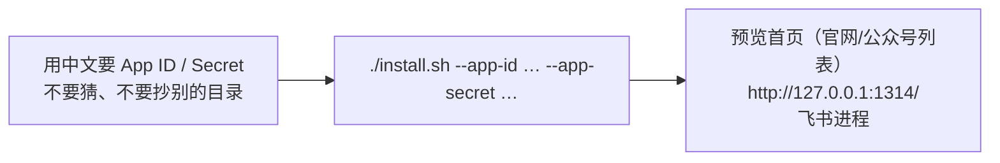

# 飞书内容助手 Agent 指南

面向可打开本仓库的 Cursor、Claude Code、Trae、OpenCode、Codex。使用者**没有技术背景**，最多本机装了一个 Agent。不要让他们自己跑命令、改 PATH、或阅读安装文档。

不要自研 tool-calling 循环；内容任务按本文件和 `skills/*/SKILL.md` 调用**该 Skill 目录内的脚本**。

`uv run bot` 只用于宿主进程：`serve`、`preview-http`。不要写成 Skill 依赖。Skill 脚本用 `uv run python skills/<name>/scripts/run.py`（走项目 `.venv`）。若执行时报 `uv` 不在 PATH，把 `uv` 换成绝对路径（`$HOME/.local/bin/uv` 或 `$HOME/.cargo/bin/uv`），不要让用户改 PATH。安装一律走仓库根目录 `./install.sh`。

## 支持的 Agent

两类角色不要混。飞书宿主 PATH 探测顺序：


可用 `AGENT_BIN` 覆盖。Cursor / Trae 只链 Skills，不会被飞书进程拉起。

| 角色 | 名称 | 行为 |
|------|------|------|
| 飞书宿主可拉起的 CLI | Claude Code（`claude`）、OpenCode（`opencode`）、Codex（`codex`） | 飞书消息编排 |
| 可打开本仓库并用 Skills 的 IDE/Agent | Cursor、Claude Code、Trae、OpenCode、Codex | 安装时软链项目级 `skills/` |

## 禁止

- 不要读取其它目录的生产密钥文件（例如 `.env.prod`）。
- 不要编造飞书 App 凭证、OSS bucket、sk。
- 不要执行 `git reset --hard` / `git clean -fd`（破坏性过强，不是 Skill）。
- 不要 `hugo new site`、不要下载第三方主题市场。
- 不要自己拼装 Python / Hugo / lark-cli 的安装步骤；一律走仓库根目录 `./install.sh`。

## 安装环境

用户说「安装」「安装环境」「初始化」「帮我装」「继续安装」时，按下面做。**不要**让用户去终端里敲命令。



1. **先要凭证。** 用中文请用户到 https://open.feishu.cn/app 创建企业自建应用，把 **App ID** 和 **App Secret** 发给你。说明只要这两项，不用他们懂命令。没有这两项就不要开装。
2. **你来执行安装**（必须联网，在仓库根目录）。把用户给的值填进参数，**不要在回复里回显 Secret**：

```bash
./install.sh --app-id '用户给的 App ID' --app-secret '用户给的 App Secret'
```

   已有完整 `.env`、用户只是说「继续安装」时，可以直接 `./install.sh`。
3. **脚本会自己做完：** `./install.sh` 安装 curl、uv、Hugo Extended、Node / lark-cli、尽量装 ffmpeg 并 `uv sync`；写入 `.env`、给本机 Agent 软链 `skills/`、构建演示站、启动预览和飞书进程。
4. **用中文汇报结果。** 成功就告诉用户打开 http://127.0.0.1:1314/ （首页左右两栏是已转换的官网文章和公众号文章），并去飞书把机器人拉进对话、发一篇云文档链接。失败就把脚本里的中文原因原样告诉用户，缺什么就说缺什么，然后按提示请用户做最少的一步（例如去 nodejs.org 装 Node，或 Mac 上先装 Homebrew），用户说「继续安装」后再跑一次 `./install.sh`。
5. **退出码 2** 表示还缺 App ID/Secret：再问一次，不要改脚本、不要编造。

若执行环境有沙箱，安装时要允许联网、允许写入项目目录和 `~/.local/bin`。

管理进程（用户说启动 / 停止 / 看看日志时由你执行，不要丢命令给他们）：

- 启动：`./scripts/start.sh`
- 状态：`./scripts/status.sh`
- 日志：`./scripts/logs.sh`
- 停止：`./scripts/stop.sh`

飞书入口还需要本机已登录的 Claude Code / OpenCode / Codex 之一。只用 Cursor / Trae 时，本地预览仍可用，但飞书里不会有机器人编排。飞书机器人与该 CLI 必须同一台机器、同一个项目根目录。

## Skills

在项目根目录（或传入 `--root`）下用 `uv run python` 执行对应脚本。若 `uv` 不在当前 PATH，用绝对路径调用 uv（常见 `$HOME/.local/bin/uv`）：

```bash
uv run python skills/download-feishu-doc/scripts/run.py --url '…'
uv run python skills/enrich-doc/scripts/run.py inspect --url '…'
uv run python skills/enrich-doc/scripts/run.py apply --url '…' --slug … --lang zh --title '…' --date YYYY-MM-DD --author '内容编辑' --categories '…' --summary '…'
uv run python skills/convert-website/scripts/run.py
uv run python skills/compress-media/scripts/run.py
uv run python skills/deploy-local/scripts/run.py
uv run python skills/convert-wechat/scripts/run.py
uv run python skills/deploy-cloud/scripts/run.py --sk '用户给的口令'
uv run python skills/clean-generated/scripts/run.py
uv run python skills/reply-preview/scripts/run.py --message-id 'om_xxx'
```

上次任务产物：`data/last-job.json`（token、slug、路径、预览 URL）。**没有新的飞书文档链接**时（例如只说「出公众号」）可先读它。用户消息里带了文档链接——哪怕和上次同一篇——必须重新跑 `download-feishu-doc`，不要用旧 `processed.md` 代替下载（云文档可能已改过）。这不是会话记忆。没有特别说明时，官网和公众号都要转换；用户明确只要一路才省略另一路。公众号读 `processed.md`，不读官网 Hugo 稿。

飞书任务结束时（提示里有 `message_id`）：**成功或失败都要**跑 `reply-preview`。IDE 里没有 `message_id` 则不要发卡片。

## 推荐顺序（由你决定，不要让飞书 Python 再编排）

```mermaid
flowchart TB
  subgraph installFlow["安装环境"]
    se["./install.sh"]
  end

  subgraph convertFlow["转换预览（默认两路）"]
    dl[download-feishu-doc] --> cw[convert-website]
    cw --> cm[compress-media]
    cm --> loc[deploy-local]
    loc --> wx[convert-wechat]
    wx --> rp2[reply-preview]
  end

  subgraph enrichFlow["补全（不转换）"]
    ei[enrich-doc inspect] --> gen[Agent 生成字段] --> ea[enrich-doc apply] --> rp1[reply-preview]
  end

  subgraph oneShot["用户明确只要一路"]
    onlySite["只要官网：省略 convert-wechat"]
    onlyWx["只要公众号：省略 convert-website，仍读 processed.md"]
  end

  subgraph publishFlow["发布 + sk + 链接"]
    both[两路预览] --> cloud["deploy-cloud --sk"] --> rp4[reply-preview]
  end

  subgraph cleanFlow["清理工作区"]
    clean[clean-generated] --> cm2[compress-media] --> loc2[deploy-local]
  end
```



清理禁止 `git reset`。栏目固定 `blog`。

## 结束时必须输出

有飞书 `message_id` 时先跑 `reply-preview`（卡片是给用户看的结果）。

然后在最终回复中单独输出：

```
官网预览=<url>
公众号预览=<url>
```

没有的那一行就省略。失败用中文说明原因，并在 `reply-preview --summary` 里写同样的原因。
