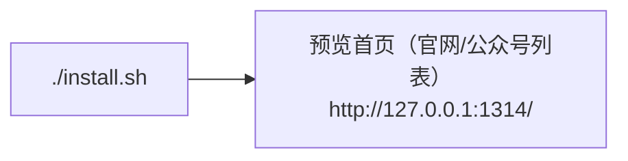

# 飞书内容助手 Agent 指南

面向可打开本仓库的豆包工作 Agent、Cursor、Claude Code、Trae、OpenCode、Codex。使用者**没有技术背景**，最多本机装了一个 Agent。不要让他们自己跑命令、改 PATH、或阅读安装文档。

不要自研 tool-calling 循环；内容任务按本文件和 `skills/*/SKILL.md` 调用**该 Skill 目录内的脚本**。

`uv run bot` 只用于预览 HTTP：`preview-http`。不要写成 Skill 依赖。Skill 脚本用 `uv run python skills/<name>/scripts/run.py`（走项目 `.venv`）。若执行时报 `uv` 不在 PATH，把 `uv` 换成绝对路径（`$HOME/.local/bin/uv` 或 `$HOME/.cargo/bin/uv`）；`hugo` 同理，换成 `$HOME/.local/bin/hugo`。不要让用户改 PATH。安装一律走仓库根目录 `./install.sh`。

飞书读写走**环境已登录的 lark-cli**（豆包工作 Agent 已内置）。由**你在对话里直接执行** lark-cli，再跑 Skill 脚本做本地加工。不要用 Python `LarkCliRunner` / subprocess 调 lark-cli。不要创建飞书应用、不要向用户要 App ID/Secret、不要下载或安装 lark-cli、调用时不要传 `--profile` 或 `--as`（含 `--as bot`）。

## 支持的 Agent

安装时会按本机已装的 IDE/Agent 软链项目级 `skills/`。豆包工作 Agent 直接使用仓库 `skills/` 与内置 lark-cli。

| 名称 | 行为 |
|------|------|
| 豆包工作 Agent | 打开本仓库编排 Skills；lark-cli 已登录 |
| Cursor、Claude Code、Trae、OpenCode、Codex | 安装时软链项目级 `skills/` |

## 禁止

- 不要读取其它目录的生产密钥文件（例如 `.env.prod`）。
- 不要编造飞书 App 凭证、OSS bucket、sk。
- 不要向用户要飞书 App ID / Secret，也不要创建企业自建应用。
- 不要执行 `git reset --hard` / `git clean -fd`（破坏性过强，不是 Skill）。
- 不要 `hugo new site`、不要下载第三方主题市场。
- 不要自己拼装 Python / Hugo 的安装步骤；一律走仓库根目录 `./install.sh`。不要安装 Node 或 lark-cli。

## 安装环境

用户说「安装」「安装环境」「初始化」「帮我装」「继续安装」时，按下面做。**不要**让用户去终端里敲命令。



1. **不要要凭证。** 不要去开放平台创建应用，不要问 App ID / Secret。
2. **你来执行安装**（必须联网，在仓库根目录）：

```bash
./install.sh
```

   已有 `.env`、用户只是说「继续安装」时，同样直接 `./install.sh`。
3. **脚本会自己做完：** 安装 curl、uv、Hugo Extended、尽量装 ffmpeg 并 `uv sync`；从 `.env.example` 写出 `.env`、给本机 Agent 软链 `skills/`、构建演示站、启动本地预览。
4. **用中文汇报结果。** 成功就告诉用户打开 http://127.0.0.1:1314/ （首页左右两栏是已转换的官网文章和公众号文章），把一篇**当前账号能打开的**飞书云文档链接发给助手即可。失败就把脚本里的中文原因原样告诉用户，缺什么就说缺什么，然后按提示请用户做最少的一步（例如 Mac 上先装 Homebrew），用户说「继续安装」后再跑一次 `./install.sh`。

若执行环境有沙箱，安装时要允许联网、允许写入项目目录和 `~/.local/bin`。

管理进程（用户说启动 / 停止 / 看看日志时由你执行，不要丢命令给他们）：

- 启动：`./scripts/start.sh`（只起预览 HTTP，不起飞书长连接）
- 状态：`./scripts/status.sh`
- 日志：`./scripts/logs.sh`
- 停止：`./scripts/stop.sh`

## Skills

在项目根目录（或传入 `--root`）下用 `uv run python` 执行对应脚本。若 `uv` 不在当前 PATH，用绝对路径调用 uv（常见 `$HOME/.local/bin/uv`）。`hugo` 不在 PATH 时用 `$HOME/.local/bin/hugo`：

```bash
# 先用 lark-cli 拉文档（不要 --profile / --as），再跑脚本
uv run python skills/download-feishu-doc/scripts/run.py --url '…'
uv run python skills/enrich-doc/scripts/run.py inspect --url '…'
uv run python skills/enrich-doc/scripts/run.py apply --url '…' --slug … --lang zh --title '…' --date YYYY-MM-DD --author '内容编辑' --categories '…' --summary '…'
uv run python skills/convert-website/scripts/run.py
uv run python skills/compress-media/scripts/run.py
uv run python skills/deploy-local/scripts/run.py
uv run python skills/convert-wechat/scripts/run.py
uv run python skills/deploy-cloud/scripts/run.py --sk '用户给的口令'
uv run python skills/clean-generated/scripts/run.py
```

`download-feishu-doc` / `enrich-doc` 的脚本**只处理本地文件**。拉云文档、写回属性表：按对应 `skills/*/SKILL.md` 用 lark-cli（`docs +fetch`、`drive +inspect`、`docs +update`）。wiki 先 `drive +inspect` 得到 docx token。正文里的图片/视频如果已是完整 URL，由 `download-feishu-doc` 脚本直接下载到 `data/jobs/<token>/media/`，不要逐个 `media-download`。只有没有 URL 的 token（画板等）才用 `docs +media-download`。缺文件时脚本会把应执行的命令打在标准输出。

上次任务产物：`data/last-job.json`（token、slug、路径、预览 URL）。**没有新的飞书文档链接**时（例如只说「出公众号」）可先读它。用户消息里带了文档链接——哪怕和上次同一篇——必须重新跑 `download-feishu-doc`，不要用旧 `processed.md` 代替下载（云文档可能已改过）。这不是会话记忆。没有特别说明时，官网和公众号都要转换；用户明确只要一路才省略另一路。公众号读 `processed.md`，不读官网 Hugo 稿。

豆包 / IDE 场景**不要**跑 `reply-preview`；直接在对话里回复预览地址。

## 推荐顺序（由你决定）

```mermaid
flowchart TB
  subgraph installFlow["安装环境"]
    se["./install.sh"]
  end

  subgraph convertFlow["转换预览（默认两路）"]
    cli[Agent 执行 lark-cli] --> dl[download-feishu-doc]
    dl --> cw[convert-website]
    cw --> cm[compress-media]
    cm --> loc[deploy-local]
    loc --> wx[convert-wechat]
  end

  subgraph enrichFlow["补全（不转换）"]
    fetch[Agent lark-cli fetch] --> ei[enrich-doc inspect]
    ei --> gen[Agent 生成字段]
    gen --> ea[enrich-doc apply]
    ea --> wr[Agent lark-cli 写回]
  end

  subgraph oneShot["用户明确只要一路"]
    onlySite["只要官网：省略 convert-wechat"]
    onlyWx["只要公众号：省略 convert-website，仍读 processed.md"]
  end

  subgraph publishFlow["发布 + sk + 链接"]
    both[两路预览] --> cloud["deploy-cloud --sk"]
  end

  subgraph cleanFlow["清理工作区"]
    clean[clean-generated] --> cm2[compress-media] --> loc2[deploy-local]
  end
```



清理禁止 `git reset`。栏目固定 `blog`。

## 结束时必须输出

在最终回复中单独输出：

```
官网预览=<url>
公众号预览=<url>
```

没有的那一行就省略。失败用中文说明原因。
