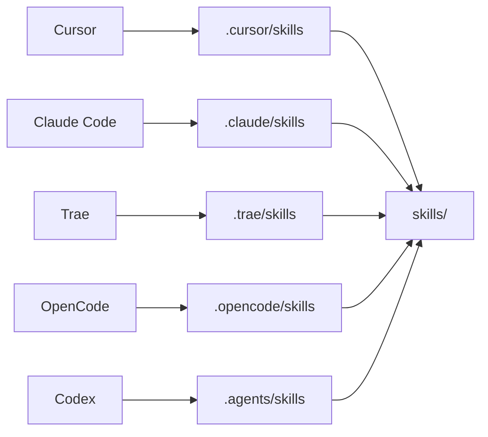

# Skills

每个子目录都是**可拷贝的完整 Skill**：脚本只依赖本目录，不要调用宿主项目的 `bot` 包。

```
skill-name/                  # 技能根目录
├── SKILL.md                 # 核心指令（必须）
├── scripts/                 # 可执行脚本（可选）
├── references/              # 参考资料（可选）
└── assets/                  # 资源文件（可选）
```

入口是 `scripts/run.py`。没有素材时不要建空的 `assets/`。

**在本仓库**（已 `uv sync`）一律走项目环境：

```bash
uv run python <本Skill目录>/scripts/run.py
```

`uv run` 用的是仓库根目录 `.venv`，**不会**根据 `scripts/requirements.txt` 另装一套。Skill 依赖须写在仓库 `pyproject.toml` 里。`uv run bot` 只用于宿主 `serve` / `preview-http`。

**拷到其他项目后**，不要原样执行上面的 `uv run`（那会去找当前工作区的 `.venv`，不一定有这些包）。按该 Skill 的 `scripts/requirements.txt` 装进目标环境，再用那个环境的 Python 跑 `scripts/run.py`。另需本机工具（如 `lark-cli` / Hugo / ffmpeg）和工作区 `.env`（含 `LARK_CLI_PROFILE`）。

仓库只维护 `skills/`。各 IDE/Agent 的发现目录由 **`./install.sh`** 在安装时按本机已装的对象生成，整目录软链到 `skills/`（不要把 Skill 拷进 `.cursor/` 等目录）。请把工作目录设为项目根目录。

下面是 **IDE/Agent 发现目录**（Cursor / Claude Code / Trae / OpenCode / Codex）。飞书宿主只拉起 `claude` / `opencode` / `codex`，与这份名单不是同一回事。

探测：本机有对应命令，或已有配置目录（`~/.cursor`、`~/.claude`、`~/.trae`、`~/.config/opencode`、`~/.codex`）。



执行时以**站点工作区**为数据根（`site/`、`data/`、`.env`），用 `--root` 或环境变量 `BOT_ROOT` 指定。
