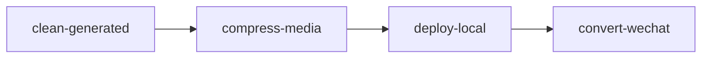

# 清理生成稿

用户能听懂的名字：**清理工作区 / 清掉预览稿**。

本目录是完整 Skill，拷到其他 Agent 的 skills 下即可用，**不要**依赖宿主项目的 CLI 包。

```
clean-generated/
├── SKILL.md
├── scripts/
│   ├── run.py
│   └── requirements.txt
├── references/
│   ├── input.md
│   └── output.md
└── assets/                  # 资源文件（本 Skill 暂无）
```

## 何时调用

仅当用户**明确**要清理生成稿、还原预览、清掉上次任务产物。不要在普通预览流程里自动跑。

清理后若还要预览：



## 命令

在**站点工作区**（含 `site/` 或 `preview/`）下执行，或传入 `--root`：

```bash
uv run python <本Skill目录>/scripts/run.py
uv run python <本Skill目录>/scripts/run.py --root /path/to/site-workspace
```

## 行为

只删除这些生成物（存在才删）：

- `preview/_wechat/`
- `data/jobs/`
- `data/last-job.json`

**禁止** `git reset --hard`、`git clean -fd`，不要动 `site/` 源稿和 git 历史。
