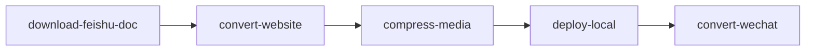

# 转换为公众号文章

用户能听懂的名字：**转换为公众号文章**。

本目录是完整 Skill，拷到其他 Agent 的 skills 下即可用，**不要**依赖宿主项目的 CLI 包。

```
convert-wechat/
├── SKILL.md
├── scripts/
│   ├── run.py
│   └── requirements.txt
├── references/
│   ├── input.md
│   └── output.md
└── assets/                  # 资源文件（本 Skill 暂无）
```

## 何时调用

默认和官网一起做。用户给了飞书文档链接、或说「转换 / 预览」而没有声明只要其中一路时，先走完整序列（含重新 `download-feishu-doc`），再跑本 Skill。不要用上次的稿。仅当用户明确只要公众号、且没有新链接时，才读 last-job 的 `processed.md`。推荐先 `deploy-local`，这样预览页里的图片是可访问的绝对 URL。



## 命令

```bash
uv run python <本Skill目录>/scripts/run.py
uv run python <本Skill目录>/scripts/run.py --markdown path/to/processed.md --root /path/to/workspace
```

默认读 last-job 的 `processed_markdown_path`（`processed.md`）。

## 依赖

见 `scripts/requirements.txt`（`markdown`、`pydantic-settings`、`pygments`）。

## 行为

- 读 `processed.md`：属性表和图片区在 `---` 之上，只把后面的正文换皮。飞书 XML 里的颜色/下划线/高亮补回来。
- 仅当正文第一行一级标题与属性表 `title` 相同，才当作文章标题去掉。正文里其它一级标题（如「# 一、…」）保留。公众号编辑器自己有标题栏。
- `figure` → 图+注；markdown 图片的 alt 也当 caption。
- grid 展平；video / 视频 callout 做成信息卡片，后面的封面图收进卡片。
- 代码块保留语言，带标题时显示标题栏，并用 Pygments 做语法高亮。
- 加粗、斜体、下划线、删除线、字体颜色、背景高亮、有序/无序列表、表格、引用都会进预览 HTML。
- 图片改成 `SITE_BASE_URL` 绝对地址。
- 写入 `preview/_wechat/{lang}/{slug}/index.html`，并更新 `preview/_wechat/index.json` 供预览首页列出公众号文章。
- 预览页左侧是文章（可切手机 / 电脑宽度），右侧可调字体、字号、主题色。正文最上方放封面图、说明和横线。预览用 CSS 变量；点「复制正文」时在浏览器里把当前计算样式写成 inline，并把原图嵌进剪贴板（不带预览框里的像素宽高，手机/电脑预览复制结果一致，裁剪交给作者）。默认勾选「复制封面图」，会把封面和说明一起复制；取消勾选则只复制正文。不要单独复制图片（`127.0.0.1` 公众号后台拉不到）。
- 没有「发布」按钮，也不接主题市场。
- 成功时打印 `公众号预览=...`

飞书里无法写入系统剪贴板，复制必须在浏览器预览页完成。
