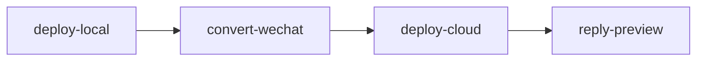

# 云端部署

用户能听懂的名字：**发布到云 / 云端部署**。

本目录是完整 Skill，由豆包工作 Agent 直接使用仓库 `skills/`。脚本只依赖本目录，**不要**调用宿主项目的 CLI 包。

```
deploy-cloud/
├── SKILL.md
├── scripts/
│   ├── run.py
│   └── requirements.txt
├── references/
│   ├── input.md
│   └── output.md
└── assets/                  # 资源文件（本 Skill 暂无）
```

## 何时调用

两路预览已经做好，**并且**用户话里带了 sk、明确要发布。未给 sk 则不要调用；脚本也会直接拒绝。



禁止从其它目录拷贝生产密钥。

## 命令

```bash
uv run python <本Skill目录>/scripts/run.py --sk '用户提供的口令'
uv run python <本Skill目录>/scripts/run.py --sk '…' --root /path/to/workspace
```

## 行为

- 校验 `--sk` 与工作区 `.env` 的 `PUBLISH_SECRET_KEY`。
- `OSS_BUCKET` 为空 → 返回 **未开通**（未配置对象存储，仅本地预览）。
- 上传 `preview/`（含官网和 `_wechat/`）。
- 成功时若 last-job 里有预览 URL，打印 `官网预览=...` / `公众号预览=...`。
- `GIT_PUSH_ENABLED` 默认关闭；**禁止** `git reset --hard`。
