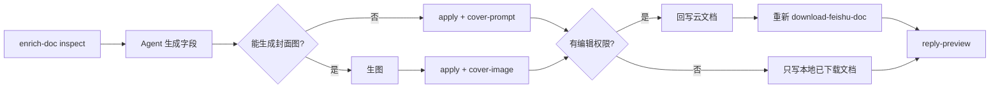

# 补全元数据

用户能听懂的名字：**补全元数据**。

本目录是完整 Skill，拷到其他 Agent 的 skills 下即可用，**不要**依赖宿主项目的 CLI 包。

```
enrich-doc/
├── SKILL.md
├── scripts/
│   ├── run.py
│   └── requirements.txt
├── references/
│   ├── input.md
│   └── output.md
└── assets/                  # 资源文件（本 Skill 暂无）
```

## 何时调用

用户说「补全」「enrich」并给出文档链接。不要顺带转换或部署。

编排方已经是带模型的 Agent：**不要**再配 `LLM_*`，**不要** curl OpenAI / 其它补全接口。脚本只负责读文档、校验字段，并按权限写回飞书或写入本地已下载文档。

## 命令

必须分两步。先 inspect，再由你生成字段，最后 apply。



```bash
uv run python <本Skill目录>/scripts/run.py inspect --url 'https://xxx.feishu.cn/docx/TOKEN'
# 不能生图时：
uv run python <本Skill目录>/scripts/run.py apply --url 'https://xxx.feishu.cn/docx/TOKEN' \
  --slug demo-article --lang zh --title '标题' --date 2026-08-22 \
  --author '小七' --categories '具身智能' --summary '摘要' \
  --cover-prompt '封面提示词'
# 能生图时（先用提示词生成图片，再传本地路径）：
uv run python <本Skill目录>/scripts/run.py apply --url 'https://xxx.feishu.cn/docx/TOKEN' \
  --slug demo-article --lang zh --title '标题' --date 2026-08-22 \
  --author '小七' --categories '具身智能' --summary '摘要' \
  --cover-image '/path/to/cover.png'
```

`inspect` 成功时标准输出是 JSON（含 `article_text`、`doc_title`、`need_cover_prompt`、`default_date`、`can_edit` 等）。失败则打印中文原因并退出码 1，此时不要 apply。`can_edit` 为 `true` / `false` / `null`（探测不到时为 `null`）。为 `false` 且还没下载时，先跑 `download-feishu-doc` 再 apply。

也可用 `--json '{...}'` 或 `--json-file path.json` 把字段一次传给 apply。

## 依赖

- 本机 `lark-cli`
- `scripts/requirements.txt`（`httpx`、`pydantic-settings`）
- 工作区 `.env` 中的 `FEISHU_APP_ID` / `FEISHU_APP_SECRET` / `LARK_CLI_PROFILE`
- 有编辑权限时回写云文档；没有则只写入本地已下载的 `processed.md`（不改 `raw.md`）。无权限且尚未下载时 apply 会失败，需先 `download-feishu-doc`

## 你来生成字段

读完 inspect 的 JSON 后，**你自己**根据正文生成下面字段，再交给 apply。只输出将写入文档的值，不要编造飞书 API 调用。

必填：`slug`、`lang`、`title`、`date`、`author`、`categories`、`summary`。

1. **语言（必须先判）** 文章有中文版与英文版。正文以中文为主 → `lang=zh`，title / summary / categories / cover_prompt 都用中文。正文以英文为主 → `lang=en`，对应字段都用英文。不要把中文稿写成英文标题摘要，反之亦然。
2. **title** 结合 `doc_title`（飞书文档标题）与正文。若 `doc_title` 非空、与主题高度吻合且语言一致，则直接用它（可只做空白/标点规范化）。否则按正文总结一个简洁准确的 title，语言与正文一致。
3. **slug** 英文 kebab-case（小写字母、数字、连字符），必须能从 title 的核心主题联想到；中文 title 用意译英文词，英文 title 提炼关键词。不要用与 title 无关的泛化词。
4. **date** `YYYY-MM-DD`，不得晚于今天。正文无明显日期时用 inspect 里的 `default_date`。
5. **author** 默认「小七」（inspect 的 `default_author`）；正文明确写了作者则用正文作者。英文稿未写作者时仍可用「小七」。
6. **categories** 1～3 个。中文稿用中文分类、中文逗号「，」分隔；英文稿用英文分类、英文逗号 `", "` 分隔。
7. **summary** 约 100 字/词以内，概括核心，语言与正文一致。
8. 若 `need_cover_prompt` 为 true：
  - **能生图**：先用 `cover_prompt` 生图，再 `apply --cover-image /path/to/image`（封面插入「图片」标题正下方，不是文档末尾）
   - **不能生图**：`apply --cover-prompt '…'`（「图片」区写提示词）
   为 false 时不要传封面图或封面提示词。

`doc_title` 与正文语言不一致时，以正文语言为准。

## 行为

- `inspect`：拉取云文档；**仅以云文档**判断是否已有可解析属性表（不看本地 `processed.md`）；几乎没有文字则拒绝。JSON 里带 `can_edit`。
- `apply`：再次拉取云文档做同样检查，校验字段后：
  - **有编辑权限**：写回云文档顶部（属性标题 + 三列表格 + 可选「图片」区）。能生图时「图片」区只插入封面图；否则写封面提示词。写回成功后**必须**重新运行 `download-feishu-doc`，保证本地与线上一致（apply 会自动触发）。
  - **没有编辑权限**：不回写云文档，只把属性表写入本地 `processed.md`（能生图则本地「图片」区引用复制的封面图，否则写提示词）。`raw.md` 保持下载原文。
  - **没有编辑权限且尚未下载**：失败，提示先 `download-feishu-doc`。
- 正文插图不算封面：仅当「图片」区已有图时才跳过封面提示词。
- 不写 Hugo、不压缩、不部署。
