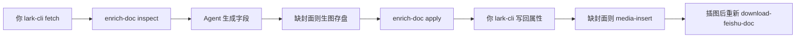

# 补全元数据

用户能听懂的名字：**补全元数据**。

本目录是完整 Skill，由豆包工作 Agent 直接使用仓库 `skills/`。脚本只依赖本目录，**不要**调用宿主项目的 CLI 包。

```
enrich-doc/
├── SKILL.md
├── scripts/
│   ├── run.py
│   └── requirements.txt
├── references/
│   ├── input.md
│   └── output.md
└── assets/                  # 资源文件（本 Skill 暂无）
```

## 何时调用

用户说「补全」「enrich」并给出文档链接。不要顺带转换或部署。

编排方已经是带模型的 Agent：**不要**再配 `LLM_*`，**不要** curl OpenAI / 其它补全接口。脚本只负责读本地稿、校验字段、写本地文件。

## 你来执行 lark-cli（脚本不会调）

调用时**不要**加 `--profile` 或 `--as`。从用户链接取出 token，**只把 token 传给 lark-cli**，不要传 `feishu.doubao.com` 等完整 URL。

inspect 之前若还没有 `data/jobs/<token>/raw.md`，先 fetch markdown：

```bash
lark-cli docs +fetch --api-version v2 --doc 'DOCX_TOKEN' --doc-format markdown
```

把 stdout 写入 `data/jobs/<token>/raw.md`。若是 JSON，`download-feishu-doc` / inspect 会取出 `data.document.content`。

知识库 wiki 先：`lark-cli drive +inspect --url 'WIKI_TOKEN' --type wiki`，用返回的 `data.token` 作为 docx token。

apply 之后脚本会写出 `data/jobs/<token>/enrich.xml`。若用户要写回云文档，你再执行：

```bash
lark-cli docs +update --doc 'DOCX_TOKEN' --command append --doc-format xml --content "$(cat 'data/jobs/<token>/enrich.xml')"
lark-cli docs +fetch --api-version v2 --doc 'DOCX_TOKEN' --doc-format xml --detail with-ids
```

把 with-ids XML 存成 `data/jobs/<token>/after.xml`，取出属性区块 id：

```bash
uv run python <本Skill目录>/scripts/run.py enrichment-ids --xml 'data/jobs/<token>/after.xml'
```

再用返回的 id 列表（逗号分隔）移到文档顶部（`--block-id` 用 `document_id` / page id）：

```bash
lark-cli docs +update --doc 'PAGE_ID' --command block_move_after --block-id 'PAGE_ID' --src-block-ids 'id1,id2,…'
```

若 inspect 的 `need_cover` 为 true，append 之后还要把你生成的封面图插进「图片」区（不要把生图提示词写进文档，也不要把封面写进本地 `processed.md`）：

```bash
lark-cli docs +media-insert --doc 'DOCX_TOKEN' --file 'data/jobs/<token>/cover.png' --align center
```

用返回的 `block_id`，移到「图片」标题后面：

```bash
lark-cli docs +update --doc 'PAGE_ID' --command block_move_after --block-id '<图片标题id>' --src-block-ids '<image_block_id>'
```

插图完成后**必须重新下载**，用云文档覆盖本地稿，不要用 apply 写过的 `processed.md` 当正文来源：

```bash
lark-cli docs +fetch --api-version v2 --doc 'DOCX_TOKEN' --doc-format markdown
lark-cli docs +fetch --api-version v2 --doc 'DOCX_TOKEN' --doc-format xml --detail full
```

把 markdown / xml 分别写入 `data/jobs/<token>/raw.md`、`raw.xml`，再跑：

```bash
uv run python skills/download-feishu-doc/scripts/run.py --token 'DOCX_TOKEN'
```

写回若报没有编辑权限，只保留本地属性表，不要把封面图写进 `processed.md`，不要假装已写回云文档。

## 命令

必须分两步。先 inspect，再由你生成字段（缺封面则先生图存盘），最后 apply。



```bash
uv run python <本Skill目录>/scripts/run.py inspect --token 'DOCX_TOKEN'
uv run python <本Skill目录>/scripts/run.py apply --token 'DOCX_TOKEN' \
  --slug demo-article --lang zh --title '标题' --date 2026-08-22 \
  --author '小七' --categories '具身智能' --summary '摘要' \
  --cover-image 'data/jobs/<token>/cover.png'
```

`inspect` 成功时标准输出是 JSON（含 `article_text`、`doc_title`、`need_cover`、`default_date` 等）。失败则打印中文原因并退出码 1，此时不要 apply。`can_edit` 恒为 `null`（是否可写回由你执行 lark-cli 时看结果）。没有本地稿时先 fetch 或先跑 `download-feishu-doc`。

也可用 `--json '{...}'` 或 `--json-file path.json` 把字段一次传给 apply。可用 `--markdown` 指向已保存的 fetch 结果。`need_cover` 为 false 时不要传 `--cover-image`。

## 依赖

- 环境已登录的 `lark-cli`（豆包工作 Agent 已内置）；由**你**调用，不要让 Python 去 subprocess
- `scripts/requirements.txt`（`httpx`、`pydantic-settings`）
- 不需要飞书 App ID / Secret

## 你来生成字段

读完 inspect 的 JSON 后，**你自己**根据正文生成下面字段，再交给 apply。只输出将写入文档的值。

必填：`slug`、`lang`、`title`、`date`、`author`、`categories`、`summary`。

1. **语言（必须先判）** 文章有中文版与英文版。正文以中文为主 → `lang=zh`，title / summary / categories 都用中文。正文以英文为主 → `lang=en`，对应字段都用英文。不要把中文稿写成英文标题摘要，反之亦然。
2. **title** 结合 `doc_title`（飞书文档标题）与正文。若 `doc_title` 非空、与主题高度吻合且语言一致，则直接用它（可只做空白/标点规范化）。否则按正文总结一个简洁准确的 title，语言与正文一致。
3. **slug** 英文 kebab-case（小写字母、数字、连字符），必须能从 title 的核心主题联想到；中文 title 用意译英文词，英文 title 提炼关键词。不要用与 title 无关的泛化词。
4. **date** `YYYY-MM-DD`，不得晚于今天。正文无明显日期时用 inspect 里的 `default_date`。
5. **author** 默认「小七」（inspect 的 `default_author`）；正文明确写了作者则用正文作者。英文稿未写作者时仍用「小七」。
6. **categories** 1～3 个。中文稿用中文分类、中文逗号「，」分隔；英文稿用英文分类、英文逗号 `", "` 分隔。
7. **summary** 约 100 字/词以内，概括核心，语言与正文一致。
8. 若 `need_cover` 为 true：你必须自己生成一张封面图再插入飞书，**不要**把生图提示词或封面图写进文档、`processed.md` 或 `enrich.xml`，也不要传 `--cover-prompt`。
   - 根据 title / summary / 正文构思画面（主体、风格、色调与正文语言一致；横版；不要出现网址、商标、大段文字）。
   - 用你的生图能力出图，保存到 `data/jobs/<token>/cover.png`（jpg / webp 也可）。
   - apply 时传 `--cover-image 'data/jobs/<token>/cover.png'`（脚本只把文件拷到任务目录，供 `media-insert` 使用，不会把图片写进 `processed.md`）。
   - 写回属性表后，用上面的 `docs +media-insert` 把这张图插进「图片」区，再把图片 block 移到「图片」标题后面。
   - 插图完成后按上面重新 fetch，再跑 `download-feishu-doc`，让本地 `raw.md` / `processed.md` 与飞书一致。
   - `need_cover` 为 false 时不要生图、不要插图、不必为封面再下载。

`doc_title` 与正文语言不一致时，以正文语言为准。

## 行为

- `inspect`：读本地稿（或 `--markdown`）；云文档对应的本地稿已有可解析属性表则拒绝；几乎没有文字则拒绝。
- `apply`：同样检查后校验字段，写入本地 `processed.md`（不改 `raw.md`、**不**把封面图写进 `processed.md`）和 `data/jobs/<token>/enrich.xml`。`processed.md` 结构为：第一行是由 `raw.md` 开头 `<title>` 转成的 markdown 一级标题，下面是属性表（缺封面时带「图片」标题、不含图），再然后是文章正文。封面以飞书为准：插图后必须重新 `download-feishu-doc`。
- 脚本**不**写回飞书；写回与插图后重新下载的步骤见上文 lark-cli。
- 正文插图不算封面：仅当「图片」区已有图时才跳过生图。
- 不写 Hugo、不压缩、不部署。
