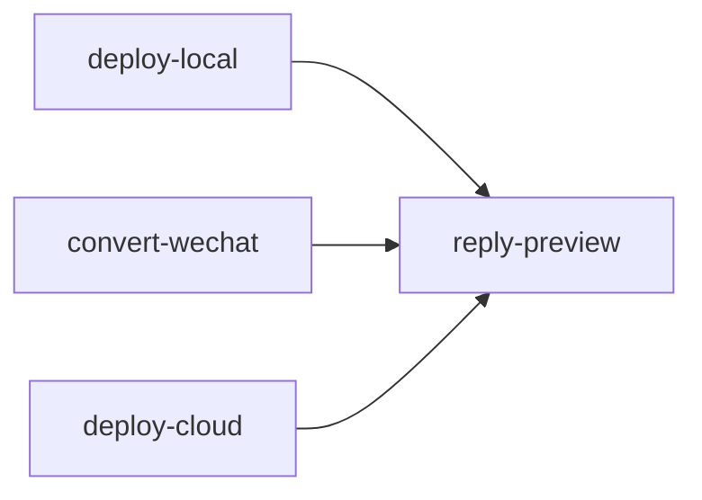

# 回复预览卡片

用户能听懂的名字：**把预览发回飞书 / 回卡片**。

本目录是完整 Skill，拷到其他 Agent 的 skills 下即可用，**不要**依赖宿主项目的 CLI 包。飞书机器人只负责秒回「收到」；**结果卡片由本 Skill 发出**，是编排的最后一步。

```
reply-preview/
├── SKILL.md
├── scripts/
│   ├── run.py
│   └── requirements.txt
├── references/
│   ├── input.md
│   └── output.md
└── assets/                  # 资源文件（本 Skill 暂无）
```

## 何时调用

提示或上下文里有飞书 `message_id`（`om_` 开头）时：**成功或失败都要调**，作为流水线最后一步。



在 IDE / 终端里自己预览、没有 `message_id` 时**不要**调用。

不要用通用 `lark-im` 代替本 Skill：这里必须用工作区 `.env` 里机器人的 `FEISHU_APP_ID` / `FEISHU_APP_SECRET` 回那条消息。

## 命令

```bash
uv run python <本Skill目录>/scripts/run.py --message-id 'om_xxx'
uv run python <本Skill目录>/scripts/run.py --message-id 'om_xxx' --site-preview 'http://127.0.0.1:1314/blog/slug/'
uv run python <本Skill目录>/scripts/run.py --message-id 'om_xxx' --summary '失败原因（中文）'
uv run python <本Skill目录>/scripts/run.py --message-id 'om_xxx' --root /path/to/workspace
```

未传 `--site-preview` / `--wechat-preview` 时，从 `data/last-job.json` 读取这两项。

## 行为

- 发交互卡片：有 URL 则带「官网预览」「公众号预览」按钮。
- 卡片接口失败则回纯文本，避免用户只看到「收到」。
- 需要 `.env` 中的 `FEISHU_APP_ID`、`FEISHU_APP_SECRET`。禁止编造凭证。
